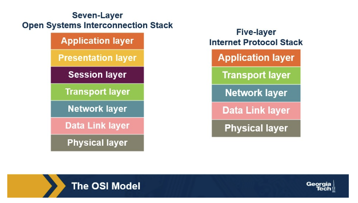

# Lesson 1: Introduction, History, and Internet Architecture

- What are the advantages and disadvantages of a layered architecture?
    - Advantages: Scalability, modularity, and flexibility
    - Disadvantages:
        - Some layers’ functionality depends on the information from other layers, violating the goal of **layer separation**
        - One layer may **duplicate** lower layer functionalities. For example, the functionality of error recovery can occur in lower layers but also in upper layers
        - Some additional **overhead** caused by the abstraction between layers
- What are the differences and similarities between the OSI model and the five-layered Internet model?
    - 
    - Similarities: both the OSI model and the five-layered Internet model has the following layers:
        - Application Layer
        - Transport Layer
        - Network Layer
        - Data Link Layer
        - Physical Layer
    - Differences, the OSI model has two additional layers: **Presentation Layer and Session Layer**, while the five-layered Internet model condenses the Application Layer, Presentation Layer, and Session Layer into the Application Layer
- What are sockets?
    - The interface between the **application** layer and the **transport** layer
- Describe each layer of the OSI model.
    - Application Layer
        - Protocols: HTTP, SMTP, FTP, DNS
        - Packets of information are referred to as a **messages**.
    - Presentation Layer
        - Plays the intermediate role of formatting the information it received from lower layers, and delivering it to the application layer
    - Session Layer
        - Responsible for managing different **transport** streams that belong to the same session between end-user application processes
        - Example: A zoom call is a session, the session layer coordinates the incoming and outgoing video/audio streams
    - Transport Layer
        - Protocols: Transmission Control Protocol (TCP), User Datagram Protocol (UDP)
        - Responsible for **end-to-end** communication between end-point hosts.
        - Packets of information are referred to as **segments**.
        - Analogy: A postal service for the Internet, managing the delivery of data between two applications.
    - Network Layer
        - Responsible for moving datagrams from one Internet host to another.
        - Protocols: the IP and the routing protocols
        - Packets of information are referred to as **datagrams**.
    - Data Link Layer
        - Responsible for moving the frames from one node to the next node after receiving datagrams from the network layer
        - Protocols: Ethernet, Point to Point Protocol (PPP), IEEE 802.11
        - Packets of information are referred to as **frames**
        - Analogy: It acts like a local courier service, responsible for the delivery of data between two devices on the same local network
    - Physical Layer
        - Facilitates the interaction between the actual hardware, responsible for transferring bits within a frame between to nodes connected through a physical link
        - Protocols: Twisted-pair copper wire, coaxial, single-mode fiber optics
- Provide examples of popular protocols at each layer of the five-layered Internet model.
- What is encapsulation, and how is it used in a layered model?
    - Encapsulation
        - At each layer, the message is a combination of two parts: 1) the **payload** which is the message from the layer above, 2) the **new appended header**
    - Decapsulation
        - At the receiving end, the process of encapsulation is reversed, with headers being stripped off at each layer
- What is the end-to-end (e2e) principle?
    - The network core should be simple and minimal, while the end systems should carry the intelligence. Specific application-level functions should not be built into lower levels at the core of the network
- What are the examples of a violation of e2e principle?
    - Violations of e2e principle refers to scenarios where it is not possible to implement a functionality entirely at end hosts, such as Network Address Translation (NAT) boxes and firewalls
- What is the EvoArch model?
    - A research model that helps study layered architecture and their evolution in a quantitative manner and explains how the hierarchical structure of they layered architecture eventually led to the **hourglass** shape
- Explain a round in the EvoArch model.
    - New nodes are added: new protocols are created and randomly placed into the different layers of the network.
    - Connections are made: The new protocols are connected to existing noes. They choose protocols to depend on from the layer below and become dependencies for protocols in the layer above.
    - Values are updated: The "evolutionary value" of every protocol in the network is recalculated.
    - Nodes are removed: The model checks for competition. Protocols that are less valuable than their competitors are removed.
- What are the ramifications of the hourglass shape of the internet?
    - Many technologies that were not originally designed for the Internet have been modified so that they have versions that can communicate over the Internet (such as Radio over IP)
    - It has been a difficult and slow process to transition to IPv6, despite the shortage of public IPv4 addresses
- Repeaters, hubs, bridges, and routers operate on which layers?
    - Repeaters and hubs operation on the physical layer (L1)
    - Bridges operate on the data link layer (L2)
    - Routers operate on the network layer (L3)
- What is a bridge, and how does it “learn”?
    - A bridge transfers frames from an input to one or multiple outputs. A learning bridge learns, populates, and maintains a **forwarding table**. The bridge consults its forwarding table so it only forwards frames on specific ports.
- What is a distributed algorithm?
    - Direct nodes send information to one another and they re-send their results back after performing calculation, so that calculation are **decentralized**.
- Explain the Spanning Tree Algorithm.
    - It runs in rounds.
    - At the very first round, every node thinks that it is the root.
    - At every round, each node sends to each neighbor node a configuration message with three fields: 1) the sending node’s ID, 2) the ID of the perceived root, and 3) the number of hops between the perceived root and the sending node.
    - At every round, each node keeps track of the best configuration messages it has received so far, and it compares that against the configuration messages it receives from neighbor nodes at that round. A configuration is better if: 1) the root has a smaller ID, 2) if both roots have equal IDs, smaller distance from the root is better, 3) if both root IDs and distances from the root are the same, sending node with the smallest ID is better
- What is the purpose of the Spanning Tree Algorithm?
    - Exclude links that lead to **loops**