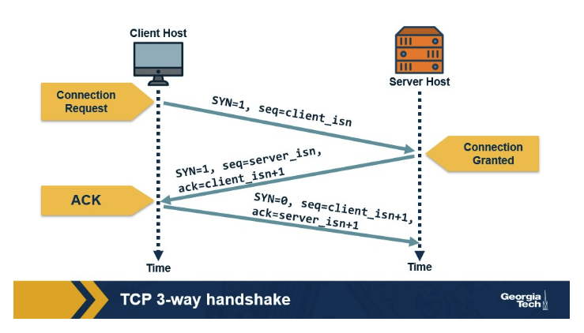
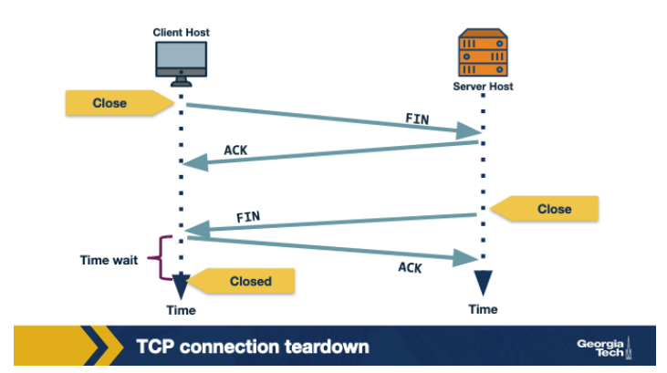
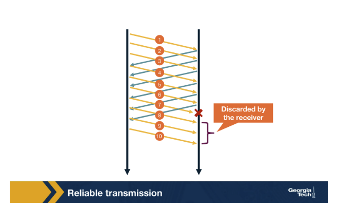
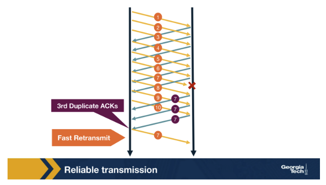
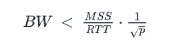

- What does the transport layer provide?
    - The transport layer provides an end-to-end connection between two applications running on different hosts. The transport layer on the sending host receives a message from the application layer and appends its own header, called a segment. This segement is then sent to the network layer which will append (encapsulate) this segment with its header information.
- What is a packet for the transport layer called?
    - Segment
- What are the two main protocols within the transport layer?
    - User Datagram Protocol (UDP)
    - Transmission Control Protocol (TCP) - used for most applications today
- What is multiplexing, and why is it necessary?
    - Multiplexing is the job performed by the **sending host** to gather data from different application process, add transport-layer header information (including source and destination port numbers), and then pass the resulting transport-layer segment down to the network layer.
    - It is necessary because a single host often runs multiple applications (like a web browser, an email client, and a streaming service) simultanously, and all these applications share a single network connection. Multplexing allows multiple application process on a host to share the same underlying network connection. 
- Describe the two types of multiplexing/demultiplexing.
    - Connectionless (UDP)
        - Socket identifier: A UDP socket is identified by a two-tuple: destination IP address and destination port number
        - Demultiplexing: the receiving host examines only the **destination port number** in the incoming UDP segment. All segments arriving at a specific destination port are forwarded to the same associated socket, regardless of their source IP address or source port number.
        - Ananloy: it's like a post office (the destination port). Anyone can send mail to that box and the post office only looks at the box number to deliver the mail.
    - Connection-oriented (TCP)
        - Socket identifier: A TCP socket is identified by a unique four-tuple: source IP address, source port number, destination IP address, and destination port numbers.
        - Demultiplexing: The receiving host must examine all four fields to determine the correct socket.
        - Analogy: it's like a dedicated, private phone line established for a specific conversation. Even if two other people call the same number (destination port), the switchboard (demultiplexer) knows exactly which specific conversation/socket each incoming message belong to based on who is calling (source IP and port).
- What are the differences between UDP and TCP?
    - UDP uses connectionless multiplexing/demultiplexing, whereas TCP uses connection-oriented multiplexing/demultiplexing.
- When would an application layer protocol choose UDP over TCP?
    - UDP offers fewer delays and better control over sending data because with UDP we have no congestion control or similar mechanisms, and no connection management overhead.
- Explain the TCP Three-way Handshake.
    - 
    - Step 1: The TCP client sends a special segment containing no data with the `SYN = 1`. The client also generates an initial sequence number (`seq = client_isn`) and includes it in this special TCP SYN segment.
    - Step 2: Upon reciving the packet, the server allocates the required resources for the connection and sends back the "connection-granted" segment called `SYNACK` segment. `seq = server_isn` (a randomly chosen initial sequence number for the server), `ack = client_isn + 1`
    - Step 3: When the client receives the SYNACK segment, it also allocates buffer and resources for the connection and sends an acknowledge with `SYN = 0`.
- Explain the TCP connection tear down.
    - 
    - Step 1: When the client wants to end the connection, it sends a segment with `FIN = 0` to the server.
    - Step 2: The server acknowledges that it receives the connection closing request and is working on it.
    - Step 3: The server then ends a segment with `FIN = 1`, indicating the connection is closed.
    - Step 4: The client sends an `ACK` for it to the server. It also waits for sometime to resend this acknowledge in case the first ACK is lost.
- What is Automatic Repeat Request or ARQ?
    - Goal: To ensure reliable communication, the sender needs to know which segments are received and which are lost.
    - How: Having the receiver send acknowledgements indicating that it has successfully received the specific segment. If not in a given period of time, the sender can assume the packet is lost and resend it.
- What is Stop and Wait ARQ?
    - Stop and Wait ARQ is the simplest method to implement reliable transmission but has low performance because of the watiing time. It works as follows:
        - The sender transmits a single data packet. 
        - The sender then stops and waits for an `ACK` from the receiver.
        - If the sender receives the `ACK` within a specific timeout period, it knows the packet was received and proceeds to send the next packet.
        - If the sender does not receive the `ACK` before the timeout expires, it assumes the packet was lost and retransmits the original packet.
- What is Go-back-N?
    - 
    - Go-back-N allows the sender to transmit multiple segments without waiting for an ACK for each one. It works as follows:
        - The sender cen send up to N unacknowledged segments, where N is the window size.
        - The receiver only sends an `ACK` for the most recently received, in-order packet. If a segment is received out of order (for example, segment 8 arrives before segment 7), the receiver will discard the out-of-order segment (8) and continue to send an ACK for the last correctly received in-order segment (6). 
        - If the sender either times out or receives a duplicated ACK, it assumes the packet and all susequent segments were lost.
        - The sender then retransmits all packaets starting from the missing one.
- What is selective ACKing?
    - Selective ACKing is a mechanism used to improve efficiency by having the sender retransmit **only the sgements that are suspected to be lost** instead of all the subsequent segments (as in the case of Go-back-N). It reduces unncessary transmission. It works as follows:
        - The receiver acknowledges a correctly received segment even if it arrives out of order. The out-of-order segments are **buffered** by the receiver.
        - The sender only retransmits the specific segment that were not acknowledged or are suspected to be missing.
        - The buffered, out-of-order packets are delivered to the application layer only once the missing segment has been successfully received, allowing the entire batch to be processed in order.
- What is fast retransmit?
    - 
    - Fast retransmit is a mechanism to detect and recover from a lost segment without having to wait for a timeout. By this, the sender can quickly retransmit the missing data. It works as follows:
        - A duplicate ACK is an acknowledgement from the receiver for a segment that the sender has already received an ACK for.
        - When the sender receives three duplicate ACKs for a particular segment, it considers that segment to be lost and immediately retransmits it.
- What is transmission control, and why do we need to control it?
    - Transmission control is the function of managing the speed and volume of data flow from a sending host to a receiving host.
    - We need it to prevent overwhelming the receiver and congesting the network.
- What is flow control, and why do we need to control it?
    - Flow control is a rate control mechanism provided by the TCP transport layer to ensure the sender's data transmission rate matches the receiver's data consumption rate. It works as follow:
        - The receiver communicates its available buffer space to the sender using a a value called receive window `rwnd`. It's calculated this way: `rwnd = RcvBuffer - [LastByteRcvd - LastByteRead]`
        - The sender monitors how much unacknowledged data it has sent (`LastByteSent - LastByteAcked`) and is contrainted by the `rwnd` value received from the receiver. The sender ensures `UnAcked Data Sent <= rwnd`.
    - We need flow control to protect the receiver's buffer from overflowing.
- What is congestion control?
    - Congestion control is the mechanism to control the transmission rate to protect the network from congestion.
- What are the goals of congestion control?
    - Efficiency, faireness, low delay, fast convergence
- What is network-assisted congestion control?
    - The network-assisted congestion control relies on the **network layer** to provide explicit feedback to the sender about congestion in the network.
- What is end-to-end congestion control?
    - In the end-to-end congestion control, the **end host** infers congestion from the network behavior and adapts the transmission rate.
- How does a host infer congestion?
    - Two signals: the packet delay and the packet loss.
- How does a TCP sender limit the sending rate?
    - A TCP sender limits its sending rate by ensuring that the amount of **unacknowledged data** it has in transit never exceeds the available window size. It works as follows: 
        - Window control: The sender can only send new data when the amount of unacknowledged data is less than the effective window size, which is the minimum of the congestion window (`cwnd`) and the receive window (`rwnd`).
        - Self-clocking mechanism: the sender uses ACKs as a probe to release new data into the network.The acknowledged data frees up space in the allowed window.
- Explain Additive Increase/Multiplicative Decrease (AIMD) in the context of TCP.
    -  AIMD is a specific mechanism TCP uses to control congestion by adjusting the rate based on **network** conditions. It employs a **probe-and-adapt** appraoch to find the network's capacity. The process is managed by adjusting the **congestion window**, which limits the max amount of unacknowledged data the sender can have in transit.
    - Additive Increase: This is the probing phase where the sender cautiously increases its sending rate, searching for available bandwidth. When the network is healthy, the `cwnd` is increased additively by about one segment/packet every Round Trip Time (RTT).
    - Multiplicative Decrease: This is the adaptation/back-off phase when congestion is detected. When the TCP sender detects a packet loss, the `cwnd` is immediately decreases to **half** of its previous value.
- What is a slow start in TCP?
    - Slow start is a TCP congestion control mechanism used to rapidly increase the sending rate of a **new** connection or a connection recovering from a severe timeout, rather than using the slow, additive increase of AIMD. It works as follows:
        - Exponential increase: The sender starts with a very small congestion window, set to 1 segment. 
        - Doubling rate: The `cwnd` is increased exponentially (doubles) after every RTT.
        - Threshold transition: The exponential increase continues until the `cwnd` reaches a prefefined value called the **slow start threshold**, and then TCP switches to AIMD.
- Is TCP fair in the case where connections have the same RTT? Explain.
    - Yes. The AIMD mechanism ensures this fairness by making the two connections converage toward an equal share of the bandwidth.
- Is TCP fair in the case where two connections have different RTTs? Explain.
    - No. A connection with a smaller RTT revies its ACKs more quickly. Since TCP increases its `cwnd` upon receiving ACKs, the connection with smaller RTT increases its sending rate faster than a connection with larger RTT. The low-RTT connection will capture a larger share of the avaialble bandwidth.
- Explain how TCP CUBIC works.
    - TCP CUBIC uses a cubic polynomial function to adjust the congestion window (`cwnd`), which decouples the growth rate from the RTT. 
    - CUBIC bases its growth on the **time elapsed since the last congestion event**. This means treats slow (high RTT) and fast (low RTT) connections more equally, addressing the unfairness issue found in order TCP versions.
- Explain TCP throughput calculation.
    - Bandwidth (BW) = data per cycle / time per cycle. 
    - , where MSS refer to maximum segement size, RTT refers to round trip time, p refers to probability loss.